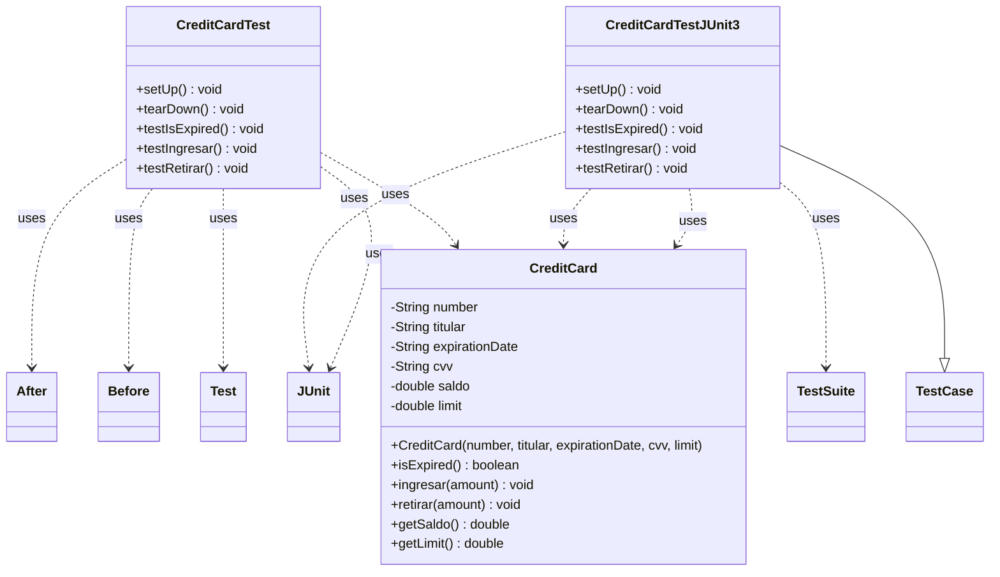

## Diagrama de Clase UML

```mermaid
classDiagram
    class CreditCard {
        -String number
        -String titular
        -String expirationDate
        -String cvv
        -double saldo
        -double limit
        +CreditCard(number, titular, expirationDate, cvv, limit)
        +isExpired() boolean
        +ingresar(amount) void
        +retirar(amount) void
        +getSaldo() double
        +getLimit() double
    }

    class CreditCardTest {
        +setUp() void
        +tearDown() void
        +testIsExpired() void
        +testIngresar() void
        +testRetirar() void
    }

    class CreditCardTestJUnit3 {
        +setUp() void
        +tearDown() void
        +testIsExpired() void
        +testIngresar() void
        +testRetirar() void
    }

    class JUnit
    class TestCase
    class TestSuite
    class Test
    class Before
    class After

    CreditCardTest ..> CreditCard : uses
    CreditCardTest ..> Test : uses
    CreditCardTest ..> Before : uses
    CreditCardTest ..> After : uses

    CreditCardTestJUnit3 --|> TestCase
    CreditCardTestJUnit3 ..> TestSuite : uses
    CreditCardTestJUnit3 ..> JUnit : uses
    CreditCardTestJUnit3 ..> CreditCard : uses
    CreditCardTest ..> JUnit : uses
    CreditCardTestJUnit3 ..> CreditCard : uses
```